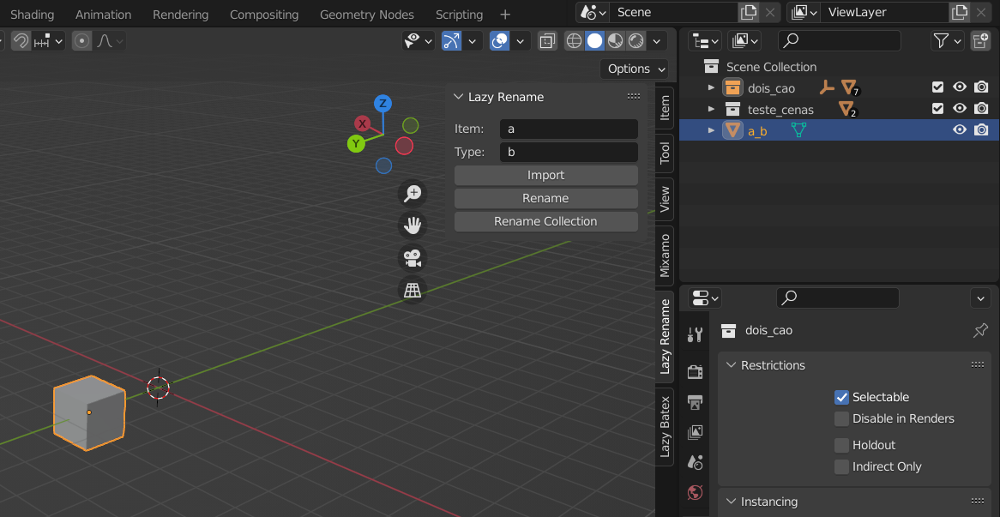

# Lazy Rename ✍️

A Blender Plugin created to help in the asset creation process for the [Lazy Builder Library](https://github.com/wafflesgama/LazyBuilderLibrary)

## Features 🗒️
- This blender plugin automatically renames the selected object (mesh name & object name) based on the **ItemId** & **ItemTypeId** fields. 

- It also can rename the parent collection based also on the **ItemId** & **ItemTypeId** fields

- The **ItemId** & **ItemTypeId** fields are stored for each object, allowing for quick further changes without requiring to rewrite them. 

## Installing 💾
1. Download the latest **lazy-rename.py** file from the [Releases section](https://github.com/wafflesgama/LazyRename/releases) 
2. Open Blender
3. Go to edit -> preferences -> addons
4. Click install button
5. Select the **lazy-rename.py** file you've downloaded
6. Check the box Next to newly added entry to enable plugin

## Usage 🧑‍💻
* After installing **Lazy Rename** panel is added to the sidebar (below item/tool/view, right side of 3d viewport)
* Sidebar can be shown/hidden with the 'N' key.